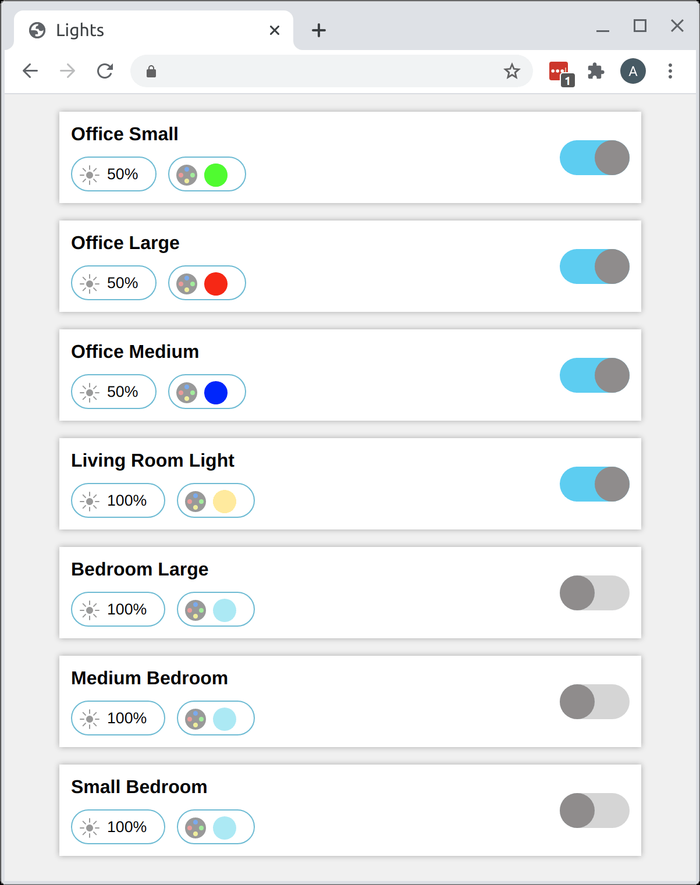

# cbyge

For this project, I reverse engineered the "C by GE" app for controlling GE WiFi-connected smart lightbulbs. To do this, I started by decompiling the Android app, and then reverse engineered the binary protocol that the app uses to talk to a server. For more details, see [Reverse Engineering C by GE](#reverse-engineering-c-by-ge).

The final products of this project are:
  1. A web API and front-end website for controlling lightbulbs.
  2. A high-level Go API for enumerating lightbulbs, getting their status, and changing their properties (e.g. brightness and color tone).

**Disclaimer:** this code is the result of reverse engineering and has not been informed by a protocol specification. As a result, there is no guarantee that it will continue to work or that it will work for every network or smart device. While others have successfully used this API in some cases, it is possible that the code makes incorrect assumptions that do not hold up under every use case.

# Website

The [server](server) directory is a self-contained web-app and JSON API endpoint for C by GE lightbulbs. The website looks like this:



Currently, the website does not directly handle two-factor authentication, and you must create a session before launching the server. To do this, run the [login_2fa](login_2fa) command with the `-email` and `-password` flags set to your account's information. The command will prompt you for the 2FA verification code (which should be found in your email). Once you enter this code, the command will spit out session info as a JSON blob. You can then pass this JSON to the `-sessinfo` argument of the server, e.g. as `-sessinfo 'JSON HERE'`. Note that part of the session expires after a week, but a running server instance will continue to work after this time since the expirable part of the session is only used once to enumerate devices.

# Go API

Newer accounts require the use of two-factor authentication. You can perform a 2FA handshake to create a session like so:


```go
callback, err := cbyge.Login2FA("my_email", "my_password", "")
// Handle error...

sessionInfo, err := callback("2FA code from email")
// Handle error...

session, err := cbyge.NewController(sessionInfo, 0)
// Handle error...
```

For older accounts that have never used 2FA before, you may be able to login directly:

```go
session, err := cbyge.NewControllerLogin("my_email", "my_password")
// Handle error...
```

Once you have a session, you can enumerate devices like so:

```go
devs, err := session.Devices()
// Handle error...
for _, x := range devs {
    fmt.Println(x.Name())
}
```

You can control bulbs like so:

```go
x := devs[0]
session.SetDeviceStatus(x, true) // turn on
session.SetDeviceLum(x, 50)      // set brightness
session.SetDeviceCT(x, 100)      // set color tone (100=blue, 0=orange)
```

You can also query a bulb's current settings:

```go
status, err := session.DeviceStatus(x)
// Handle error...
fmt.Println(status.IsOn)
fmt.Println(status.ColorTone)
```

# Reverse Engineering C by GE

In this section, I'll take you through how I reverse-engineered parts of the C by GE protocol.

The first step was to disassemble the Android app with [Apktool](https://ibotpeaches.github.io/Apktool/). This produces [Smali](https://github.com/JesusFreke/smali) disassembly for the app. Poking around, I searched for URLs and domain names. Initially, I found this:

```smali
.field public static final API_VERSION:Ljava/lang/String; = "v2/"

.field public static final BASE_URL:Ljava/lang/String; = "https://api-ge.xlink.cn:443/"
```

Seeing where this API endpoint was used quickly led me to a set of JSON-based HTTP calls for logging in, listing devices, etc. However, this endpoint didn't seem to provide a way to 1) get the status of devices, or 2) update the color or brightness of the devices.

There had to be some other way the app was communicating with the smart bulbs. However, the disassembly was riddled with code for Bluetooth and LAN communication, and I was a bit worried there *was* no global API endpoint for controlling the bulbs. What was worse, the C by GE app complained whenever I turned off Bluetooth and then tried to use it. However, I eventually found that I could open the app, let it do its thing, and then turn off Bluetooth and WiFi while still having control over the bulbs. All I had to do was hit the Android "back" button whenever the app opened a popup asking me to "Turn on Location Tracking" (a weird name for Bluetooth and WiFi, mind you).

At this point, I was fairly sure the app wasn't making some other mysterious HTTP(S) connections. Interestingly, though, I did find the domain "xlink.cn" elsewhere in the Smali code:

```smali
.field public static final CM_SERVER_ADDRESS:Ljava/lang/String; = "cm-ge.xlink.cn"

.field public static final CM_SERVER_PORT:I = 0x5ce2
```

Holy cow, could this be a raw socket-based protocol? I tried, and sure enough I could open a TCP connection to `cm-ge.xlink.cn:23778`. However, the Smali was also riddled with logic for **UDP** packets, so I was unsure which protocol the app would be using. With this in mind, I created [packet-proxy](https://github.com/unixpickle/packet-proxy) and set it listening on port 23778. Then I replaced the domain `cm-ge.xlink.cn` with my IP address in the Smali code, recompiled the app into an APK, and installed it on my phone.

Surely enough, my patched C by GE app immediately connected to my packet-proxy instance and started chatting away. Notably, it only did this when Bluetooth and WiFi were turned off. Otherwise, it seemed to prefer one of those for locally communicating with the smart bulbs.

The protocol the app chose to use was by far the easiest outcome to deal with: 1) it was TCP rather than UDP, 2) it was completely unencrypted. **The lack of encryption is rather alarming in hindsight, since the first message includes an authorization token which never seems to change for my account.**

I found that the messages from the app to the server could be "replayed" effectively. Once I figured out which bytes (or "packets", thanks to packet-proxy) were for turning on and off lights, I could simply open a new socket and send these same packets and get the same outcomes. This was a great sign. Worst case scenario, I already had a way of implementing what I wanted for myself, even if it wouldn't be very general.

At this point, it was time to dig deeper into the protocol. After a combination of experimentation with packet-proxy and digging into the Smali disassembly, I had a fairly general understanding of what communication was taking place. The first thing I noticed was that the communication took place in "messages", which started with a type and a length field (in big endian). The next thing was figuring out which packet types where which, and eventually how the specific packets themselves were encoded. Here's an example of a packet from the server containing the statuses of my three devices:

```
73 00 00 00 60 47 e2 be ab 00 37 00 7e 00 01 00 00 f9 52 4e
00 03 00 00 00 03 00 03 00 81 01 00 00 81 01 00 00 00 00 35
00 00 00 27 00 00 00 00 00 00 00 02 00 00 01 00 00 00 01 00
00 00 00 35 00 00 00 27 00 00 00 00 00 00 00 01 00 00 01 00
00 00 01 00 00 00 00 35 00 00 00 27 00 00 00 00 00 00 00 c8
7e 
```

Once I had enough of the protocol worked out, I created an API for it. This API can list devices, get their statuses, and update various properties of the devices (e.g. brightness and color tone). Surprisingly, I found my API to be much faster and more reliable than the app itself. It seems that trying to use Bluetooth or WiFi before falling back to a remote server causes the app to be much flakier and less reliable than it could be.

As a final note, I don't own all of the devices supported by this app, so I wasn't motivated (or easily able) to reverse-engineer how these devices would work. For example, the same company produces smart outlets, sensors, and light switches.
